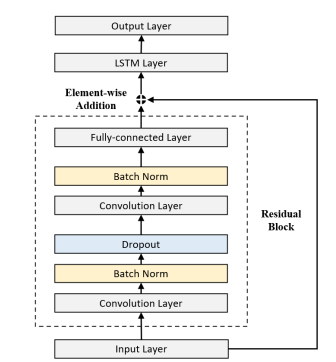

	
    

# Stock forcasting with ResNLS
The main goal of this project is to attempt to forecast stock prices, mainly focusing on the S&P 500 index. The main task is to replicate the model architecture of ResNLS, as described in the paper "ResNLS: An Improved Model for Stock Price Forecasting". The performance of the ResNLS model will be compared with two baseline models: ARIMA and timefm.

-- Project Status: Completed
## ResNLS architecture

	
    
ResNLS architecture

ResNLS is a residual neural network with long short-term memory. It combines the residuals with long short-term memory networks to further enhance the existing deep network. As shown, the proposed architecture deals with sequential data like time series or natural language processing. In such problems, both local feature extraction and long-range dependencies are of great importance.

Basically, the ResNLS architecture makes good use of the powerful feature extraction capabilities of residual blocks in efficiently training a very deep neural network, followed by feeding these features into an LSTM layer for the capture of temporal dependencies in the input sequence. This enables learning complex patterns and predicting with accuracy. Residual connections at the first stage of feature extraction alleviate the common vanishing gradient problem in deep neural networks. Bidirectionalization of the architecture further enables the LSTM layer to process the input sequence both in the forward and the backward directions, hence increasing its contextual information capturing capability.

## Data
This project utilizes stock market data from the `yfinance` package in Python, which makes it easy for access to Yahoo finance data. Precisely, the dataset contains the following:

- Primary ticker: ^GSPC (S&P 500 index)
- Other popular stocks
- Date range:
  - Training set: [2004-08-19, 2020-04-30]
  - Validation set: [2020-05-01, 2022-04-30]
  - Test set: [2022-05-01, 2024-05-01]
- Interval: Daily (1d)

These data splits have been done based on those dates into training, validation, and test datasets, thereby enabling a complete model performance exercise over the diverse timeframes. This entire dataset spans close to two decades and serves as the base that will be used for training and testing the ResNLS model on different market conditions and trends.

## ResNLS Prediction result

	
    
Prediction result

In the process of training and validation, it gave a very low validation loss of 0.0052 for the ResNLS model; it turns out this fit the training data very well without overfitting.

For the test dataset, ResNLS returned the following performance metrics:

- Mean Squared Error: 2544.32
- Mean Absolute Scaled Error: 1.24
- Root Mean Squared Error: 50.44
- Symmetric Mean Absolute Percentage Error: 0.93
- Mean Absolute Error: 39.12

These results mean that the model can predict accurately on unseen data; along with several evaluation metrics, it has very low error metrics.

## ResNLS Prediction result on test set

	
    
Prediction result on test set (apply simple trading algorithm)

It plots the predicted stock prices against the actual Close prices, with buying and selling signals according to the trading algorithm based on day-to-day price movements.

The expected return from the trading strategy based on the model's forecasts was –37.92%, considerably lower than that realized by a portfolio with the same characteristics, at 7.67%. Also, the maximum expected return per trade was 3.51%, while that maximally realized was 5.04%.

> These results indicate that the trading strategy derived from the price forecasts of the model is faring badly against the actual market movements. It appears to underestimate the upside potential of the market, hence making suboptimal trading decisions and huge losses.

## Evaluation
| Model         | Real return   | SMAPE         | MAE       | RMSE      | Directional Accuracy  |
| ------------- | ------------- | ---------     | -----     | -----     | --------------------- |
| ResNLS        | **7.67 %**    | 0.935         | 39.1      | 50.4      | **50.2**              |
| ARIMA         | -3.64 %       | 0.802         | **34.3**  | **45.8**  | 49.8                  |
| TimeFM        | -8.62 %       | **0.00920**   | 38.5      | 50.4      | 49.1                  |

The performance of the ResNLS model in terms of real returns using the day-to-day price movement trading algorithm was superior with a return of 7.67%, compared to ARIMA (-3.64%) and TimeFM (-8.62%). The ResNLS model also shows the highest directional accuracy at 50.2%, slightly more than for the other models. However, the other models show a lower average prediction error in terms of MAE and RMSE, with ARIMA performing better.

### Error Analysis
While the ResNLS model does better than ARIMA with regard to returns, the higher MAE and RMSE values for it suggest that its different predictions might be farthest from the real values. The extremely low SMAPE for the TimeFM indicates that this model could be excellent at predicting percentage changes, but this doesn't translate to better real returns. For ResNLS, the directional accuracy slightly above 50% suggests that much better results could still be realized in terms of price movement directional predictions.

## Future work
Future work may focus on enhancing the accuracy of the ResNLS model, followed by the tuning of the trading strategy. Additional features could include sentiment analysis, hyperparameter tuning, or even architectural variations. 

More sophisticated trading algorithms capable of risk management and portfolio optimization would help alleviate the upside underestimation in markets. It would provide information for a proper diversification strategy and improve overall performance if it were extended to predict multiple stocks at one time.

## Resource
- [ResNLS: An Improved Model for Stock Price Forecasting](https://arxiv.org/pdf/2312.01020)

- [ARIMA model](https://lengyi.medium.com/arima-model-%E0%B8%95%E0%B8%AD%E0%B8%99%E0%B8%97%E0%B8%B5%E0%B9%88-6-fitting-arima-model-d0d2bc916c68)

- [TimesFM (Time Series Foundation Model)](https://github.com/google-research/timesfm)